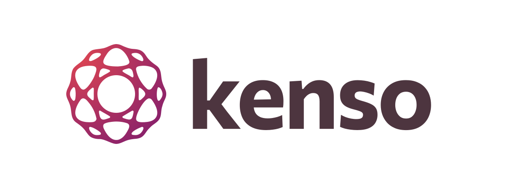

<p align="center">
  
</p>

<h3 align="center" style="margin-bottom: 0.3em;">
  Talk to your docs
</h3>

<p align="center" style="max-width: 720px; margin: 0.5em auto 1.5em auto; color: #6b7280;">
  kenso turns a folder of Markdown docs into a searchable knowledge base for people and AI agents. Answers from your own docs. Zero config. No infrastructure. Always deterministic.
</p>

<p align="center">
  <a href="https://pypi.org/project/kenso/"></a>
  <a href="https://pypi.org/project/kenso/"></a>
  <a href="https://github.com/fvena/kenso/actions"></a>
  <a href="https://codecov.io/gh/fvena/kenso"></a>
  <!-- <a href="https://pypi.org/project/kenso/"></a> -->
  <a href="https://github.com/fvena/kenso/blob/main/LICENSE"></a>
</p>


<p align="center">
  <a href="https://fvena.github.io/kenso/">Docs</a> ·
  <a href="https://fvena.github.io/kenso/guide/getting-started">Getting Started</a> ·
  <a href="https://fvena.github.io/kenso/guide/mcp-integration">Editor Setup</a>
</p>

## Why kenso

Your documentation already has the answers. But finding them means remembering which file, scanning entire documents, or piecing together information scattered across multiple places. kenso does it with one question.

- **Direct answers** — get the right paragraph without reading the whole doc.
- **Cross-document reasoning** — one question, ten docs, one synthesized answer.
- **Natural queries** — search how you think, not how the author wrote.
- **Brainstorm, audit, plan** — think with your docs, not from guesses.
- **Cross-domain** — bridge code and business rules in one question.

## Quick Start

Try without installing (requires [uv](https://docs.astral.sh/uv/)):

```bash
uvx kenso ingest ./docs/     # index your markdown files

# optional — verify the index before connecting an editor
uvx kenso search "deployment pipeline"
uvx kenso stats
```

Or install:

```bash
pip install kenso[yaml]      # install with YAML frontmatter support
kenso ingest ./docs/         # index your markdown files

# optional — verify the index before connecting an editor
kenso search "deployment pipeline"
kenso stats
```

That's it. Now [connect your editor](#mcp-integration) — the MCP client starts kenso automatically.

> kenso works with any Markdown file. <br />
> To improve retrieval quality, see [Writing Effective Documents](#writing-effective-documents).

## How it compares

The LLM already understands meaning — what it lacks is the right source text. kenso finds that text with keyword search and lets the LLM reason over it.

| | Embedding RAG | Wiki | kenso |
|---|:---:|:---:|:---:|
| **Setup** | | | |
| Infrastructure | Model + vector DB + pipeline | SaaS platform | — |
| Free | ✗ | ✗ | ✓ |
| **Content** | | | |
| Visual editor | ✗ | ✓ | ✗ |
| Readable source | ✗ | ✓ | ✓ |
| Team collaboration | ✗ | ✓ | ✓ |
| Change review | ✗ | Partial | ✓ |
| Full history | ✗ | Partial | ✓ |
| CI/CD ready | ✗ | ✗ | ✓ |
| Effortless authoring | ✓ | ✓ | ✗ |
| Deterministic | ✗ | ✓ | ✓ |
| **Search** | | | |
| Semantic search | ✓ | ✗ | ✗ |
| Keyword precision | Partial | ✗ | ✓ |
| Inspectable ranking | ✗ | ✗ | ✓ |
| Cross-doc navigation | ✗ | ✗ | ✓ |
| Vocabulary-independent | ✓ | ✗ | ✗ |
| **Agent access** | | | |
| MCP native | ✗ | ✗ | ✓ |
| Multi-client | ✗ | ✗ | ✓ |
| Runs locally | ✗ | ✗ | ✓ |
| Non-technical access | ✗ | ✓ | ✗ |

## MCP Integration

kenso is a standard [MCP](https://modelcontextprotocol.io/) server. It works with any client that supports the protocol — if yours isn't listed below, set `command` to `kenso` with args `["serve"]` in your client's MCP settings. If you installed in a virtualenv, use the full path to the binary as `command` instead — you can find it with `which kenso`.

> For shared access across a team, kenso can also run as a remote HTTP server. See [Remote Deployment](#remote-deployment).

### AI Code Editors

<details>
<summary><strong>Cursor</strong></summary>

Create or edit `.cursor/mcp.json` in your project root (or `~/.cursor/mcp.json` for global access):
```json
{
  "mcpServers": {
    "kenso": {
      "command": "kenso",
      "args": ["serve"]
    }
  }
}
```

Restart Cursor after saving. The kenso tools will appear in Composer and Agent mode. See [Cursor MCP docs](https://docs.cursor.com/context/model-context-protocol) for more info.

</details>

<details>
<summary><strong>VS Code</strong></summary>

Create or edit `.vscode/mcp.json` in your project root:
```json
{
  "servers": {
    "kenso": {
      "command": "kenso",
      "args": ["serve"]
    }
  }
}
```

> VS Code uses `"servers"`, not `"mcpServers"`.

See [VS Code MCP docs](https://code.visualstudio.com/docs/copilot/chat/mcp-servers) for more info.

</details>

<details>
<summary><strong>Windsurf</strong></summary>

Edit `~/.codeium/windsurf/mcp_config.json`:
```json
{
  "mcpServers": {
    "kenso": {
      "command": "kenso",
      "args": ["serve"]
    }
  }
}
```

Restart Windsurf after saving. See [Windsurf MCP docs](https://docs.windsurf.com/windsurf/cascade/mcp) for more info.

</details>

<details>
<summary><strong>Zed</strong></summary>

Open your Zed `settings.json` (`Cmd+,` or `Ctrl+,`) and add:
```json
{
  "context_servers": {
    "kenso": {
      "command": {
        "path": "kenso",
        "args": ["serve"]
      },
      "settings": {}
    }
  }
}
```

See [Zed Context Server docs](https://zed.dev/docs/assistant/context-servers) for more info.

</details>

<details>
<summary><strong>JetBrains</strong></summary>

Go to `Settings` → `Tools` → `AI Assistant` → `Model Context Protocol (MCP)`, click `+ Add`, select `As JSON`, and paste:
```json
{
  "mcpServers": {
    "kenso": {
      "command": "kenso",
      "args": ["serve"]
    }
  }
}
```

Click `Apply` to save. See [JetBrains AI Assistant MCP docs](https://www.jetbrains.com/help/ai-assistant/configure-an-mcp-server.html) for more info.

</details>

### AI Assistants & CLI

<details>
<summary><strong>Claude Code</strong></summary>

One-liner:
```bash
claude mcp add kenso -- kenso serve
```

Or add to `.claude/mcp.json` in your project root:
```json
{
  "mcpServers": {
    "kenso": {
      "command": "kenso",
      "args": ["serve"]
    }
  }
}
```

See [Claude Code MCP docs](https://docs.anthropic.com/en/docs/claude-code/mcp) for more info.

</details>

<details>
<summary><strong>Claude Desktop</strong></summary>

Open Claude Desktop settings (`Settings` → `Developer`) and edit `claude_desktop_config.json`:
```json
{
  "mcpServers": {
    "kenso": {
      "command": "kenso",
      "args": ["serve"]
    }
  }
}
```

Restart Claude Desktop after saving. See [Claude Desktop MCP docs](https://modelcontextprotocol.io/quickstart/user) for more info.

</details>

<details>
<summary><strong>Codex CLI / Codex Desktop</strong></summary>

Edit `~/.codex/config.toml` (shared by both CLI and desktop app):
```toml
[mcp_servers.kenso]
command = "kenso"
args = ["serve"]
```

> If you see startup timeout errors, try adding `startup_timeout_ms = 30_000`.

</details>

<details>
<summary><strong>Gemini CLI</strong></summary>

Edit `~/.gemini/settings.json`:
```json
{
  "mcpServers": {
    "kenso": {
      "command": "kenso",
      "args": ["serve"]
    }
  }
}
```

See [Gemini CLI MCP docs](https://google-gemini.github.io/gemini-cli/docs/tools/mcp-server.html) for more info.

</details>

<details>
<summary><strong>Cline</strong></summary>

Open the Cline MCP settings panel (☰ → MCP Servers), click `+ Add`, and configure:
```json
{
  "mcpServers": {
    "kenso": {
      "command": "kenso",
      "args": ["serve"]
    }
  }
}
```

</details>

### Web interfaces

Claude and ChatGPT support connecting to remote MCP servers. This requires kenso to be [deployed remotely](#remote-deployment) with a public HTTPS URL.

<details>
<summary><strong>Claude</strong></summary>

Requires Pro, Max, Team, or Enterprise plan.

1. Go to `Settings` → `Connectors`
2. Click "Add custom connector"
3. Paste your kenso URL (e.g. `https://kenso.your-domain.com/mcp`)
4. Click "Add"

The kenso tools will appear in the search and tools menu of new conversations. See [Claude custom connectors docs](https://support.claude.com/en/articles/11503834-building-custom-connectors-via-remote-mcp-servers) for more info.

</details>

<details>
<summary><strong>ChatGPT</strong></summary>

Requires Plus, Pro, Business, or Enterprise plan.

1. Go to `Settings` → `Apps & Connectors` → `Advanced settings`
2. Enable Developer Mode
3. Click "Create" to add a new connector
4. Paste your kenso URL (e.g. `https://kenso.your-domain.com/mcp`)
5. Click "Create"

Enable the connector in each new conversation via the Developer Mode menu. See [ChatGPT MCP docs](https://developers.openai.com/apps-sdk/deploy/connect-chatgpt/) for more info.

</details>

<br />

> **Multiple knowledge bases:** Add one connector per kenso instance, each with its own URL and database. The LLM sees all active connectors and routes queries automatically.

### Platform Notes

<details>
<summary><strong>Windows</strong></summary>

On Windows, wrap the command with `cmd` so MCP clients can locate the binary:
```json
{
  "mcpServers": {
    "kenso": {
      "command": "cmd",
      "args": ["/c", "kenso", "serve"]
    }
  }
}
```

If `kenso` is installed in a virtualenv, use the full path instead:
```json
{
  "mcpServers": {
    "kenso": {
      "command": "C:\\Users\\you\\.venv\\Scripts\\kenso.exe",
      "args": ["serve"]
    }
  }
}
```

</details>

## Remote Deployment

By default, kenso runs locally over stdio. For shared access across a team, deploy it as a remote HTTP server.
```bash
KENSO_TRANSPORT=streamable-http KENSO_HOST=0.0.0.0 KENSO_PORT=8000 kenso serve
```

Clients connect by URL instead of command:
```json
{
  "mcpServers": {
    "kenso": {
      "url": "https://kenso.your-domain.com/mcp"
    }
  }
}
```

In production, place kenso behind a reverse proxy (nginx, Caddy) to add HTTPS. For local testing, use `http://your-server:8000/mcp` directly.

<details>
<summary>Security and platform options</summary>

**Security** — kenso does not include authentication. Use your reverse proxy for bearer token or basic auth, your platform's built-in auth (Cloud Run, Railway, Azure), or restrict access by network (VPN, firewall, IP allowlist).

**Platform options** — any platform that runs Python works: Railway, Render, Fly.io, Google Cloud Run, or a simple VPS with Docker.

</details>

## Commands

### kenso ingest

Scan a directory for Markdown files and load them into the database.
```
kenso ingest <path>
```

<details>
<summary>What happens under the hood</summary>

1. Recursively scan for `.md` files, skip files under 50 characters
2. Hash each file (SHA-256 of the full raw text including frontmatter) — skip unchanged files
3. Parse YAML frontmatter (title, category, tags, aliases, answers, relates_to)
4. Split by H2 into chunks, sub-split oversized sections at H3/H4
5. Capture pre-H2 content as an overview chunk ("Document Title — Overview")
6. Build `searchable_content` for each chunk = chunk text + aliases + answers + tags
7. Index into SQLite FTS5 with weighted columns (title 10×, section_path 8×, tags 7×, category 5×, content 1×)
8. Insert `relates_to` as typed bidirectional links

</details>

### kenso serve

Start the MCP server.
```
kenso serve
```

### kenso search

Search documents from the command line. Returns the top 5 results with score, path, title, and highlighted snippet.
```
kenso search <query>
```

<details>
<summary>What happens under the hood</summary>

1. Build FTS5 cascade:
    - try AND (all terms)
    - then NEAR/10 (terms within 10 tokens)
    - then OR (any term)
    - stop at first stage with enough results
2. Fetch 3× the requested limit as candidates to leave room for deduplication
3. Deduplicate: keep only the highest-scoring chunk per document
4. Re-rank by relation density — documents that link to other results get a score boost
5. Enrich results with tags, category, and related document count

</details>

### kenso stats

Show database statistics: document count, chunk count, storage size, links, and breakdown by category.
```
kenso stats
```

## MCP Tools

| Tool | Description |
|------|-------------|
| `search_docs(query, category?, limit?)` | Keyword search with BM25 ranking, deduplication, and relation re-ranking |
| `search_multi(queries, category?, limit?)` | Multi-query search with Reciprocal Rank Fusion merge |
| `get_doc(path, max_length?)` | Retrieve full document content by path |
| `get_related(path, depth?, relation_type?)` | Navigate the document graph with configurable depth and relation type filter |

For detailed parameter types, defaults, and return schemas, see [llms-full.txt](llms-full.txt). For how search ranking and the document graph work internally, see [How kenso works](docs/how_it_works.md).

## Configuration

kenso works with zero config. All settings are optional, via environment variables.

### Database

The database is created automatically on first `kenso ingest`. To reset, delete the file and re-ingest. Each project gets its own isolated database by default.

| Variable | Default | Description |
|----------|---------|-------------|
| `KENSO_DATABASE_URL` | (cascade above) | SQLite database path override |


<details>
<summary>Database location</summary>
kenso resolves the database location automatically:

1. `KENSO_DATABASE_URL` — explicit override, always wins
2. `.kenso/docs.db` in the current directory — project-local (default for new projects)
3. `~/.local/share/kenso/docs.db` — global fallback
</details>


<details>
<summary>Shared knowledge base across projects</summary>
```bash
export KENSO_DATABASE_URL=~/.local/share/kenso/shared.db
kenso ingest ./docs/
```
</details>

<br />

> **Important:** Add `.kenso/` to your `.gitignore` — it's a derived index, not source code.

> SQLite runs in WAL mode — multiple readers can operate concurrently. Multiple `kenso serve` instances reading the same database is safe.

### Remote deployment

Only needed when sharing kenso across a team. See [Remote Deployment](#remote-deployment).

| Variable | Default | Description |
|----------|---------|-------------|
| `KENSO_TRANSPORT` | `stdio` | `stdio` for local, `streamable-http` for remote |
| `KENSO_HOST` | `127.0.0.1` | Bind address (`0.0.0.0` to expose externally) |
| `KENSO_PORT` | `8000` | HTTP port |

### Search tuning

These affect retrieval quality. The defaults work well for most knowledge bases.

| Variable | Default | When to change |
|----------|---------|----------------|
| `KENSO_CHUNK_SIZE` | `4000` | Lower (2000) if your docs have many short, focused sections. Higher (6000) if sections are long and self-contained. Affects how documents are split at H2 boundaries — oversized sections get sub-split at H3/H4. |
| `KENSO_CHUNK_OVERLAP` | `0` | Set to 100–200 if you notice that queries miss content at section boundaries. Adds the last N characters of each chunk as prefix to the next one. |
| `KENSO_CONTENT_PREVIEW_CHARS` | `200` | The preview length shown to the LLM in search results. The LLM uses this to decide whether to request the full document. Increase if your lead sentences tend to be longer. |
| `KENSO_SEARCH_LIMIT_MAX` | `20` | Maximum results the LLM can request per search. The default of 20 is generous — most queries return useful results in the top 3–5. |

### Debugging

| Variable | Default | Description |
|----------|---------|-------------|
| `KENSO_LOG_LEVEL` | `INFO` | Set to `DEBUG` to see every FTS5 query, score, and chunk match |

### Example

```bash
# Remote deployment with larger chunks and debug logging
KENSO_TRANSPORT=streamable-http \
KENSO_HOST=0.0.0.0 \
KENSO_CHUNK_SIZE=6000 \
KENSO_LOG_LEVEL=DEBUG \
kenso serve
```

## Performance

Tested with a 36-query eval harness across 10 retrieval categories (exact keyword, synonym, cross-domain, vocabulary mismatch, pre-H2 content, chunk ambiguity, question-style, frontmatter enrichment, result diversity, cluster coherence):

- **100%** hit rate — correct document in top 5 for every query
- **97.2%** MRR — correct document at position #1 in most cases
- **5/5** feature tests for graph traversal, typed relations, and multi-query merge
- **0 regressions** across 4 development sprints

Run it yourself:

```bash
python tests/eval/eval_harness.py
```

Benchmark against a saved snapshot:

```bash
python tests/eval/eval_harness.py --compare baseline
```

## Writing Effective Documents

kenso works with any Markdown. But adding frontmatter significantly improves retrieval:
```yaml
---
title: CI/CD Deployment Pipeline
category: infrastructure
tags: deployment, CI/CD, rollback, blue-green
aliases:
  - deploy pipeline
  - continuous deployment
answers:
  - How is code deployed to production?
relates_to:
  - path: infrastructure/monitoring.md
    relation: receives_from
---
```

The key principles: use specific titles (indexed at 10× weight), add tags with synonyms, write a summary paragraph before the first H2, and link related documents with `relates_to`.

For the full guide — field reference, document structure tips, relation types, and a pre-commit checklist — see [Writing Documents for kenso](docs/writing_guide.md).

## Troubleshooting

**kenso search returns no results** — Run `kenso stats` to check if docs are indexed. If zero docs, run `kenso ingest <path>`.

**"No such table: chunks"** — The database schema changed. Delete the database file (`.kenso/docs.db` or `~/.local/share/kenso/docs.db`) and re-ingest.

**MCP server not connecting** — Verify the command path is correct. If installed in a venv, use the full path (e.g. `/path/to/.venv/bin/kenso`). Restart your editor after changing MCP config.

## License

MIT

---

**kenso** — inspired by Japanese 検索 (kensaku): to search.
